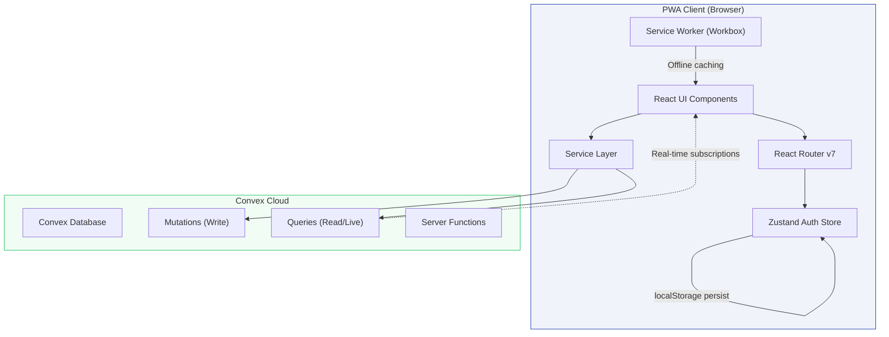
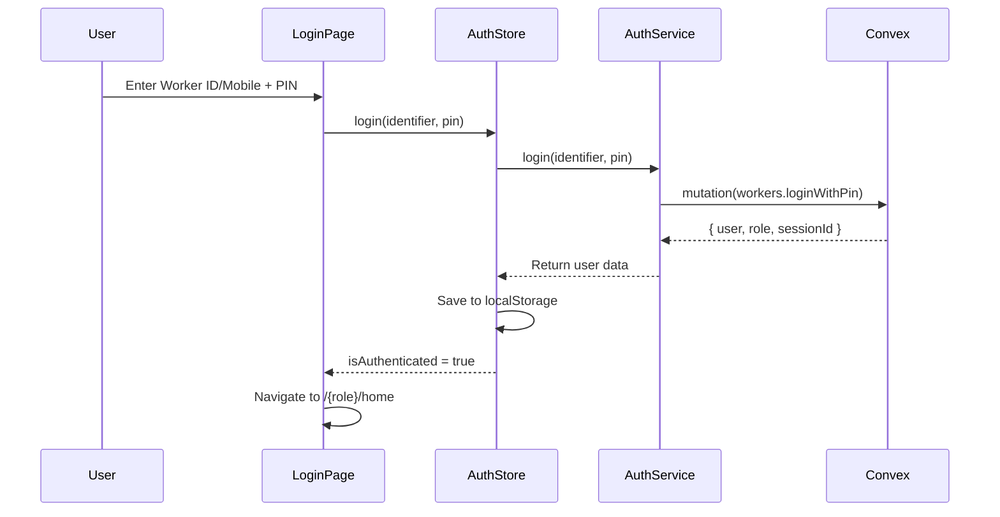
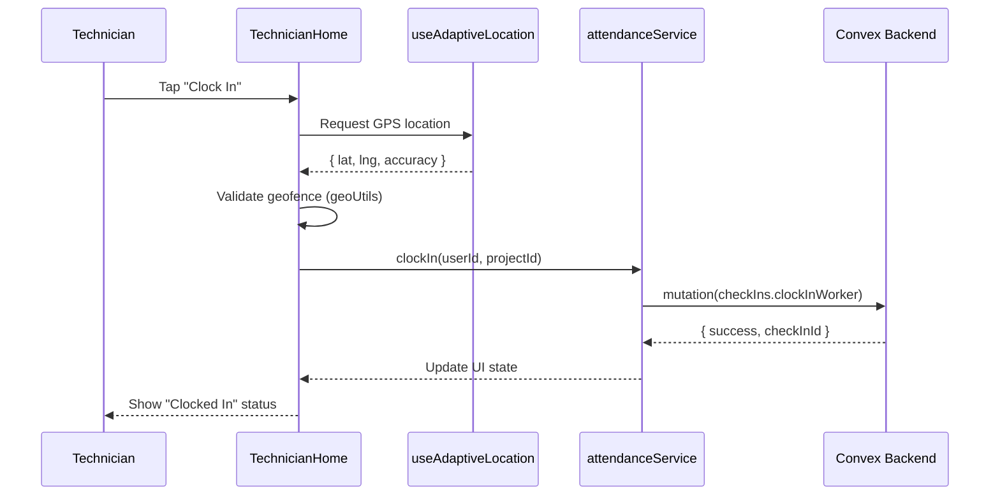
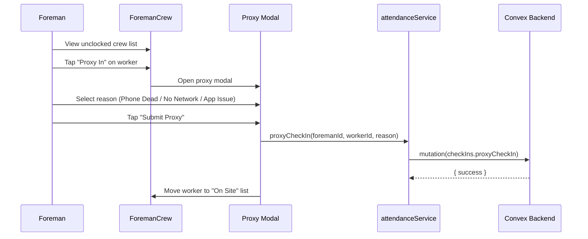
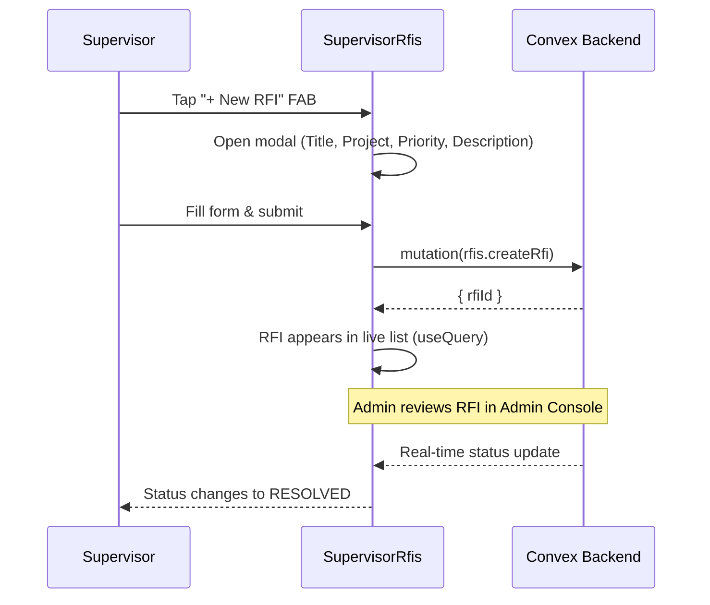
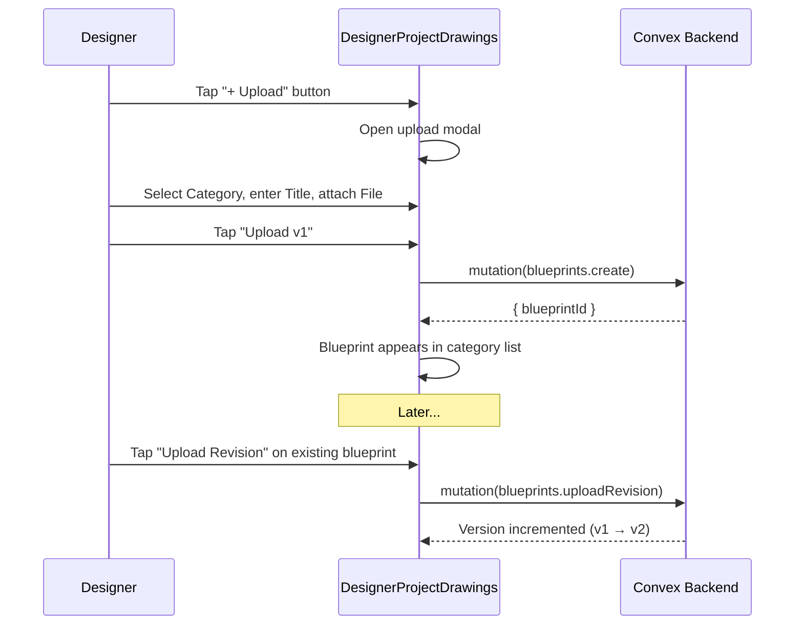

# MEPac PWA — Codebase Documentation

> **MEPac** (MEP Access & Control) is a mobile-first Progressive Web App for field workforce management in MEP (Mechanical, Electrical, Plumbing) construction projects. It enables technicians, foremen, supervisors, and designers to manage attendance, projects, RFIs, disputes, and blueprints from any device.

---

## Table of Contents

1. [Technology Stack](#1-technology-stack)
2. [Project Structure](#2-project-structure)
3. [Architecture Overview](#3-architecture-overview)
4. [Application Bootstrap & Entry Point](#4-application-bootstrap--entry-point)
5. [Authentication & Session Management](#5-authentication--session-management)
6. [Role-Based Routing & Access Control](#6-role-based-routing--access-control)
7. [User Roles & Page Breakdown](#7-user-roles--page-breakdown)
8. [Backend Services (Convex)](#8-backend-services-convex)
9. [State Management (Zustand)](#9-state-management-zustand)
10. [Reusable Components](#10-reusable-components)
11. [Design System & Theming](#11-design-system--theming)
12. [PWA Configuration](#12-pwa-configuration)
13. [Push Notifications](#13-push-notifications)
14. [Build & Deployment](#14-build--deployment)
15. [Git & Branching Strategy](#15-git--branching-strategy)
16. [Workflow Diagrams](#16-workflow-diagrams)

---

## 1. Technology Stack

| Layer | Technology | Version | Purpose |
|---|---|---|---|
| **UI Framework** | React | 19.2.7 | Component-based UI rendering |
| **Routing** | React Router DOM | 7.18.1 | Client-side navigation & nested layouts |
| **State Management** | Zustand | 5.0.14 | Lightweight global state (auth store) |
| **Backend / BaaS** | Convex | 1.45.0 | Real-time database, serverless functions, live queries |
| **Build Tool** | Vite | 8.1.1 | Fast dev server & production bundler |
| **Styling** | TailwindCSS | 3.4.19 | Utility-first CSS with custom design tokens |
| **Icons** | Lucide React | 1.26.0 | Modern SVG icon library |
| **PWA** | vite-plugin-pwa | 1.3.0 | Service worker, manifest, offline caching |
| **Linting** | oxlint | 1.71.0 | Fast JavaScript linter |
| **Deployment** | Vercel | — | Hosting with SPA rewrites |

---

## 2. Project Structure

```
mepacc-pwa/
├── index.html                    # HTML shell (SPA entry point)
├── package.json                  # Dependencies & scripts
├── vite.config.js                # Vite + PWA + SSL + chunking config
├── tailwind.config.js            # Design system tokens (colors, fonts, spacing)
├── postcss.config.js             # PostCSS with Tailwind & Autoprefixer
├── vercel.json                   # Vercel SPA rewrite rules
├── design.md                     # Design specification document
│
├── public/                       # Static assets (icons, favicon)
│
└── src/
    ├── main.jsx                  # App bootstrap (React root, providers)
    ├── App.jsx                   # Root component (all route definitions)
    ├── convex.js                 # Convex client initialization
    ├── index.css                 # Global CSS + Tailwind directives
    │
    ├── components/               # Shared reusable UI components
    │   ├── BottomNav.jsx         #   Floating pill-shaped mobile navbar
    │   ├── Button.jsx            #   Styled button (primary/secondary/danger)
    │   ├── Card.jsx              #   Container card with border & shadow
    │   ├── Input.jsx             #   Labeled text input
    │   ├── Select.jsx            #   Custom dropdown select
    │   ├── PinInput.jsx          #   6-digit PIN entry with auto-focus
    │   ├── ErrorBoundary.jsx     #   React error boundary wrapper
    │   ├── GoogleSignInButton.jsx#   Google OAuth sign-in trigger
    │   ├── NotificationBellButton.jsx  # Bell icon + unread badge
    │   ├── NotificationDrawer.jsx      # Slide-in notification panel
    │   ├── PushNotificationListener.jsx# Bridges Convex → Browser notifications
    │   └── SessionEnforcerModal.jsx    # Single-device session enforcement
    │
    ├── layouts/                  # Role-specific shell layouts
    │   ├── TechnicianLayout.jsx  #   Shell for /technician/* routes
    │   ├── ForemanLayout.jsx     #   Shell for /foreman/* routes
    │   ├── SupervisorLayout.jsx  #   Shell for /supervisor/* routes
    │   └── DesignerLayout.jsx    #   Shell for /designer/* routes
    │
    ├── pages/                    # Page-level components (by role)
    │   ├── LoginPage.jsx         #   Shared login (Worker ID/Mobile + PIN)
    │   ├── AcceptInvite.jsx      #   Invitation acceptance flow
    │   ├── PinSetup.jsx          #   First-time PIN creation
    │   ├── technician/           #   Technician role pages (5 pages)
    │   ├── foreman/              #   Foreman role pages (6 pages)
    │   ├── supervisor/           #   Supervisor role pages (7 pages)
    │   └── designer/             #   Designer role pages (5 pages)
    │
    ├── routes/
    │   └── ProtectedRoute.jsx    # Auth + role guard wrapper
    │
    ├── services/                 # API service layer (Convex mutations/queries)
    │   ├── authService.js        #   Login, logout, PIN change, session claim
    │   ├── attendanceService.js  #   Clock-in/out, crew attendance, proxy check-in
    │   ├── jobService.js         #   Projects & job assignments
    │   └── pushNotificationService.js  # Browser Notifications API bridge
    │
    ├── store/
    │   └── authStore.js          # Zustand auth store (user, role, session)
    │
    ├── hooks/
    │   └── useAdaptiveLocation.js# Geolocation hook with GPS fallback
    │
    ├── utils/
    │   ├── colors.js             # Project gradient color utilities
    │   └── geoUtils.js           # Geofencing & distance calculations
    │
    └── mock/
        └── mockData.js           # Development mock data (users, projects, etc.)
```

---

## 3. Architecture Overview



### Key Architectural Decisions

| Decision | Rationale |
|---|---|
| **Convex as BaaS** | Provides real-time subscriptions, serverless functions, and a managed database — no custom backend needed |
| **Zustand over Redux** | Minimal boilerplate for a simple auth-only global state |
| **Role-based nested routing** | Each role gets its own layout shell and route group, enforced by `ProtectedRoute` |
| **Service layer abstraction** | All Convex API calls are wrapped in service functions, isolating backend coupling from UI components |
| **PWA with Workbox** | Enables "Add to Home Screen" on mobile, offline caching, and push notifications for field workers |
| **Single-device session enforcement** | Ensures one active login per worker across devices, critical for attendance integrity |

---

## 4. Application Bootstrap & Entry Point

### [main.jsx](file:///c:/Users/afsal/OneDrive/Desktop/expo%20go/mepac/mepacc-pwa/src/main.jsx)

The app mounts with three nested providers:

```
StrictMode
  └── ConvexProvider (real-time backend client)
       └── BrowserRouter (client-side routing)
            └── App (route definitions)
```

### [convex.js](file:///c:/Users/afsal/OneDrive/Desktop/expo%20go/mepac/mepacc-pwa/src/convex.js)

Initializes the Convex client pointing to the cloud deployment:
- **URL**: `https://small-guineapig-782.convex.cloud` (or `VITE_CONVEX_URL` env var)
- Uses `anyApi` for dynamic function references (no codegen required)

---

## 5. Authentication & Session Management

### Login Flow



### Key Files

| File | Purpose |
|---|---|
| [LoginPage.jsx](file:///c:/Users/afsal/OneDrive/Desktop/expo%20go/mepac/mepacc-pwa/src/pages/LoginPage.jsx) | Login UI — Worker ID or 10-digit mobile + 6-digit PIN |
| [authStore.js](file:///c:/Users/afsal/OneDrive/Desktop/expo%20go/mepac/mepacc-pwa/src/store/authStore.js) | Zustand store with `login()`, `logout()`, `updateUser()` |
| [authService.js](file:///c:/Users/afsal/OneDrive/Desktop/expo%20go/mepac/mepacc-pwa/src/services/authService.js) | Convex mutations for auth (login, changePin, claimSession) |
| [SessionEnforcerModal.jsx](file:///c:/Users/afsal/OneDrive/Desktop/expo%20go/mepac/mepacc-pwa/src/components/SessionEnforcerModal.jsx) | Real-time single-device enforcement modal |

### Session Persistence

- Auth state is persisted to `localStorage` under key `mepac_auth_session`
- On app reload, `authStore` reads from localStorage to restore the session
- Each device generates a unique `mepac_device_session_id` for session tracking

### Single-Device Enforcement

The `SessionEnforcerModal` component:
1. Subscribes to `workers.getActiveSession` (real-time Convex query)
2. Compares the server's `currentSessionId` with the local device's session ID
3. If they differ → shows a blocking modal with options to **Reclaim** or **Logout**

---

## 6. Role-Based Routing & Access Control

### [App.jsx](file:///c:/Users/afsal/OneDrive/Desktop/expo%20go/mepac/mepacc-pwa/src/App.jsx) — Route Map

| Route Pattern | Role | Layout | Pages |
|---|---|---|---|
| `/login` | Public | None | Login |
| `/accept-invite` | Public | None | Accept Invite |
| `/technician/*` | `technician` | TechnicianLayout | Home, Calendar, Account, Profile, Change PIN |
| `/foreman/*` | `foreman` | ForemanLayout | Home, Crew, Calendar, Account, Profile, Change PIN |
| `/supervisor/*` | `supervisor` | SupervisorLayout | Home, Projects, Project Detail, RFIs, Account, Profile, Change PIN |
| `/designer/*` | `designer` | DesignerLayout | Projects, Project Drawings, Account, Profile, Change PIN |
| `*` (catch-all) | — | — | Redirect to `/login` |

### [ProtectedRoute.jsx](file:///c:/Users/afsal/OneDrive/Desktop/expo%20go/mepac/mepacc-pwa/src/routes/ProtectedRoute.jsx)

Guards each role group:
- **Not authenticated** → Redirect to `/login`
- **Wrong role** → Redirect to `/{actualRole}/home`
- **Authorized** → Render children (layout + page)

### Layout Pattern

Each layout follows the same structure:
```
<div className="min-h-screen bg-surface">
  <main className="page safe-bottom">
    <Outlet />           ← Page content renders here
  </main>
  <BottomNav items={...} /> ← Floating pill-shaped bottom navbar
</div>
```

---

## 7. User Roles & Page Breakdown

### 🔧 Technician (`/technician/*`)

| Page | File | Key Features |
|---|---|---|
| **Home** | [TechnicianHome.jsx](file:///c:/Users/afsal/OneDrive/Desktop/expo%20go/mepac/mepacc-pwa/src/pages/technician/TechnicianHome.jsx) | GPS clock-in/out, active job card, daily task list, weather widget |
| **Calendar** | [TechnicianCalendar.jsx](file:///c:/Users/afsal/OneDrive/Desktop/expo%20go/mepac/mepacc-pwa/src/pages/technician/TechnicianCalendar.jsx) | Monthly attendance calendar, day-by-day records |
| **Account** | [TechnicianAccount.jsx](file:///c:/Users/afsal/OneDrive/Desktop/expo%20go/mepac/mepacc-pwa/src/pages/technician/TechnicianAccount.jsx) | Settings menu (profile, change PIN, logout) |
| **Profile** | [TechnicianProfile.jsx](file:///c:/Users/afsal/OneDrive/Desktop/expo%20go/mepac/mepacc-pwa/src/pages/technician/TechnicianProfile.jsx) | View/edit personal details |
| **Change PIN** | [TechnicianChangePin.jsx](file:///c:/Users/afsal/OneDrive/Desktop/expo%20go/mepac/mepacc-pwa/src/pages/technician/TechnicianChangePin.jsx) | Old PIN → New PIN → Confirm flow |

**Bottom Nav**: Home · Calendar · Account

---

### 👷 Foreman (`/foreman/*`)

| Page | File | Key Features |
|---|---|---|
| **Home** | [ForemanHome.jsx](file:///c:/Users/afsal/OneDrive/Desktop/expo%20go/mepac/mepacc-pwa/src/pages/foreman/ForemanHome.jsx) | GPS clock-in/out, crew overview, daily toolbox talk, task list |
| **Crew** | [ForemanCrew.jsx](file:///c:/Users/afsal/OneDrive/Desktop/expo%20go/mepac/mepacc-pwa/src/pages/foreman/ForemanCrew.jsx) | Crew attendance list, proxy check-in modal with custom dropdown |
| **Calendar** | [ForemanCalendar.jsx](file:///c:/Users/afsal/OneDrive/Desktop/expo%20go/mepac/mepacc-pwa/src/pages/foreman/ForemanCalendar.jsx) | Monthly attendance calendar |
| **Account** | [ForemanAccount.jsx](file:///c:/Users/afsal/OneDrive/Desktop/expo%20go/mepac/mepacc-pwa/src/pages/foreman/ForemanAccount.jsx) | Settings menu |
| **Profile** | [ForemanProfile.jsx](file:///c:/Users/afsal/OneDrive/Desktop/expo%20go/mepac/mepacc-pwa/src/pages/foreman/ForemanProfile.jsx) | View/edit personal details |
| **Change PIN** | [ForemanChangePin.jsx](file:///c:/Users/afsal/OneDrive/Desktop/expo%20go/mepac/mepacc-pwa/src/pages/foreman/ForemanChangePin.jsx) | PIN change flow |

**Bottom Nav**: Home · Crew · Calendar · Account

---

### 📋 Supervisor (`/supervisor/*`)

| Page | File | Key Features |
|---|---|---|
| **Home** | [SupervisorHome.jsx](file:///c:/Users/afsal/OneDrive/Desktop/expo%20go/mepac/mepacc-pwa/src/pages/supervisor/SupervisorHome.jsx) | Dashboard KPIs, project overview, crew stats, daily summary |
| **Projects** | [SupervisorProjects.jsx](file:///c:/Users/afsal/OneDrive/Desktop/expo%20go/mepac/mepacc-pwa/src/pages/supervisor/SupervisorProjects.jsx) | Project list with status filters, search |
| **Project Detail** | [SupervisorProjectDetail.jsx](file:///c:/Users/afsal/OneDrive/Desktop/expo%20go/mepac/mepacc-pwa/src/pages/supervisor/SupervisorProjectDetail.jsx) | Detailed project view with crew, tasks, progress |
| **RFIs & Disputes** | [SupervisorRfis.jsx](file:///c:/Users/afsal/OneDrive/Desktop/expo%20go/mepac/mepacc-pwa/src/pages/supervisor/SupervisorRfis.jsx) | RFI/Dispute hub with filters, threaded messages, dispute audit trail |
| **Account** | [SupervisorAccount.jsx](file:///c:/Users/afsal/OneDrive/Desktop/expo%20go/mepac/mepacc-pwa/src/pages/supervisor/SupervisorAccount.jsx) | Settings menu |
| **Profile** | [SupervisorProfile.jsx](file:///c:/Users/afsal/OneDrive/Desktop/expo%20go/mepac/mepacc-pwa/src/pages/supervisor/SupervisorProfile.jsx) | View/edit personal details |
| **Change PIN** | [SupervisorChangePin.jsx](file:///c:/Users/afsal/OneDrive/Desktop/expo%20go/mepac/mepacc-pwa/src/pages/supervisor/SupervisorChangePin.jsx) | PIN change flow |

**Bottom Nav**: Home · Projects · RFIs · Account

---

### 🎨 Designer (`/designer/*`)

| Page | File | Key Features |
|---|---|---|
| **Projects** | [DesignerProjects.jsx](file:///c:/Users/afsal/OneDrive/Desktop/expo%20go/mepac/mepacc-pwa/src/pages/designer/DesignerProjects.jsx) | Assigned project list with gradient cards |
| **Project Drawings** | [DesignerProjectDrawings.jsx](file:///c:/Users/afsal/OneDrive/Desktop/expo%20go/mepac/mepacc-pwa/src/pages/designer/DesignerProjectDrawings.jsx) | Blueprint manager — upload, revise, delete, version history |
| **Account** | [DesignerAccount.jsx](file:///c:/Users/afsal/OneDrive/Desktop/expo%20go/mepac/mepacc-pwa/src/pages/designer/DesignerAccount.jsx) | Settings menu |
| **Profile** | [DesignerProfile.jsx](file:///c:/Users/afsal/OneDrive/Desktop/expo%20go/mepac/mepacc-pwa/src/pages/designer/DesignerProfile.jsx) | View/edit personal details |
| **Change PIN** | [DesignerChangePin.jsx](file:///c:/Users/afsal/OneDrive/Desktop/expo%20go/mepac/mepacc-pwa/src/pages/designer/DesignerChangePin.jsx) | PIN change flow |

**Bottom Nav**: Projects · Account

---

## 8. Backend Services (Convex)

All backend communication goes through the service layer in `src/services/`. Each service wraps Convex mutations (writes) and queries (reads).

### Service Files

| Service | File | Convex Endpoints Used |
|---|---|---|
| **Auth** | [authService.js](file:///c:/Users/afsal/OneDrive/Desktop/expo%20go/mepac/mepacc-pwa/src/services/authService.js) | `workers.loginWithPin`, `workers.changePin`, `workers.claimSession` |
| **Attendance** | [attendanceService.js](file:///c:/Users/afsal/OneDrive/Desktop/expo%20go/mepac/mepacc-pwa/src/services/attendanceService.js) | `checkIns.getTodayStatus`, `checkIns.clockInWorker`, `checkIns.clockOutWorker`, `checkIns.getMonthlyAttendance`, `checkIns.getCrewAttendance`, `checkIns.proxyCheckIn` |
| **Jobs/Projects** | [jobService.js](file:///c:/Users/afsal/OneDrive/Desktop/expo%20go/mepac/mepacc-pwa/src/services/jobService.js) | `projects.getActiveJobForWorker`, `projects.getSupervisorProjects` |
| **Push Notifications** | [pushNotificationService.js](file:///c:/Users/afsal/OneDrive/Desktop/expo%20go/mepac/mepacc-pwa/src/services/pushNotificationService.js) | Browser Notifications API + Service Worker |

### Convex Real-Time Queries (used directly in components)

Some components use `useQuery()` from `convex/react` for **live subscriptions**:

| Component | Query | Purpose |
|---|---|---|
| `SessionEnforcerModal` | `workers.getActiveSession` | Live session monitoring |
| `SupervisorRfis` | `rfis.list` | Real-time RFI list |
| `DesignerProjectDrawings` | `blueprints.*` | Live blueprint data |
| `NotificationDrawer` | `notifications.getForWorker` | Real-time notification feed |

---

## 9. State Management (Zustand)

### [authStore.js](file:///c:/Users/afsal/OneDrive/Desktop/expo%20go/mepac/mepacc-pwa/src/store/authStore.js)

The only global store. Manages authentication state with localStorage persistence.

```
┌──────────────────────────────────────┐
│           Auth Store (Zustand)       │
├──────────────────────────────────────┤
│ State:                               │
│   • user: object | null              │
│   • role: string | null              │
│   • isAuthenticated: boolean         │
│   • isLoading: boolean               │
│   • error: string | null             │
├──────────────────────────────────────┤
│ Actions:                             │
│   • login(phone, pin, force?)        │
│   • logout()                         │
│   • updateUser(updates)              │
│   • clearError()                     │
├──────────────────────────────────────┤
│ Persistence:                         │
│   localStorage key: mepac_auth_session│
└──────────────────────────────────────┘
```

> [!NOTE]
> Component-level state (e.g., form inputs, modal open/close, filter selections) is managed with React `useState` hooks, not Zustand. Only cross-cutting auth state lives in the global store.

---

## 10. Reusable Components

| Component | File | Description |
|---|---|---|
| **BottomNav** | [BottomNav.jsx](file:///c:/Users/afsal/OneDrive/Desktop/expo%20go/mepac/mepacc-pwa/src/components/BottomNav.jsx) | Floating dark pill-shaped bottom navbar with active tab highlighting |
| **Button** | [Button.jsx](file:///c:/Users/afsal/OneDrive/Desktop/expo%20go/mepac/mepacc-pwa/src/components/Button.jsx) | Styled button with `primary`, `secondary`, `danger` variants and size options |
| **Card** | [Card.jsx](file:///c:/Users/afsal/OneDrive/Desktop/expo%20go/mepac/mepacc-pwa/src/components/Card.jsx) | Container with rounded corners, border, and shadow |
| **Input** | [Input.jsx](file:///c:/Users/afsal/OneDrive/Desktop/expo%20go/mepac/mepacc-pwa/src/components/Input.jsx) | Labeled text input with consistent styling |
| **Select** | [Select.jsx](file:///c:/Users/afsal/OneDrive/Desktop/expo%20go/mepac/mepacc-pwa/src/components/Select.jsx) | Custom dropdown select component |
| **PinInput** | [PinInput.jsx](file:///c:/Users/afsal/OneDrive/Desktop/expo%20go/mepac/mepacc-pwa/src/components/PinInput.jsx) | 6-digit PIN entry with auto-focus between boxes |
| **ErrorBoundary** | [ErrorBoundary.jsx](file:///c:/Users/afsal/OneDrive/Desktop/expo%20go/mepac/mepacc-pwa/src/components/ErrorBoundary.jsx) | Catches render errors and displays fallback UI |
| **NotificationBellButton** | [NotificationBellButton.jsx](file:///c:/Users/afsal/OneDrive/Desktop/expo%20go/mepac/mepacc-pwa/src/components/NotificationBellButton.jsx) | Bell icon with unread count badge |
| **NotificationDrawer** | [NotificationDrawer.jsx](file:///c:/Users/afsal/OneDrive/Desktop/expo%20go/mepac/mepacc-pwa/src/components/NotificationDrawer.jsx) | Slide-in panel with real-time notification feed |
| **SessionEnforcerModal** | [SessionEnforcerModal.jsx](file:///c:/Users/afsal/OneDrive/Desktop/expo%20go/mepac/mepacc-pwa/src/components/SessionEnforcerModal.jsx) | Blocking modal for single-device session enforcement |
| **PushNotificationListener** | [PushNotificationListener.jsx](file:///c:/Users/afsal/OneDrive/Desktop/expo%20go/mepac/mepacc-pwa/src/components/PushNotificationListener.jsx) | Bridges Convex notifications to browser notification bar |

---

## 11. Design System & Theming

Defined in [tailwind.config.js](file:///c:/Users/afsal/OneDrive/Desktop/expo%20go/mepac/mepacc-pwa/tailwind.config.js):

### Color Palette

| Token | Value | Usage |
|---|---|---|
| `primary` | `#1E40AF` | Primary buttons, active states, links |
| `primary-light` | `#3B82F6` | Hover states, lighter accents |
| `primary-dark` | `#00288E` | Bottom nav active tab background |
| `accent` | `#FF6B35` | Call-to-action highlights |
| `success` | `#22C55E` | Positive states (clocked in, resolved) |
| `warning` | `#F59E0B` | Caution states |
| `error` | `#EF4444` | Error states, disputes, high priority |
| `surface` | `#F8FAFC` | Page background |
| `surface-card` | `#FFFFFF` | Card backgrounds |
| `text-primary` | `#0B1C30` | Main body text |
| `text-secondary` | `#444653` | Supporting text |
| `text-muted` | `#6B7280` | Hint/placeholder text |

### Typography

| Token | Font | Usage |
|---|---|---|
| `font-sans` | Inter | Body text |
| `font-heading` | IBM Plex Sans | Headings, titles |
| `font-mono` | JetBrains Mono | Codes, timestamps, IDs |

### Border Radius

| Token | Value |
|---|---|
| `rounded-sm` | 8px |
| `rounded-md` | 12px |
| `rounded-lg` | 16px |
| `rounded-xl` | 20px |
| `rounded-full` | 9999px |

---

## 12. PWA Configuration

Configured in [vite.config.js](file:///c:/Users/afsal/OneDrive/Desktop/expo%20go/mepac/mepacc-pwa/vite.config.js) using `vite-plugin-pwa`:

| Feature | Setting |
|---|---|
| **App Name** | MEPac — Field Workforce Management |
| **Display Mode** | `standalone` (full-screen, no browser chrome) |
| **Theme Color** | `#1E3A5F` |
| **Register Type** | `autoUpdate` (service worker auto-updates) |
| **Offline Caching** | All JS, CSS, HTML, images, fonts via Workbox `globPatterns` |
| **Font Caching** | Google Fonts cached for 1 year with `CacheFirst` strategy |

### Build Optimization

Manual chunking splits vendor code into 4 chunks:
- `vendor-react` — React, React DOM, React Router
- `vendor-convex` — Convex client
- `vendor-icons` — Lucide React icons
- `vendor-libs` — All other node_modules

---

## 13. Push Notifications

### [pushNotificationService.js](file:///c:/Users/afsal/OneDrive/Desktop/expo%20go/mepac/mepacc-pwa/src/services/pushNotificationService.js)

Bridges Convex real-time notifications to the browser's native notification bar:

1. **Permission Check** → Uses `Notification.requestPermission()`
2. **Service Worker Route** → Tries `registration.showNotification()` first (works on mobile PWA)
3. **Fallback** → Falls back to `new Notification()` for desktop browsers
4. **Features** → Vibration pattern, badge icon, click-to-focus

### [PushNotificationListener.jsx](file:///c:/Users/afsal/OneDrive/Desktop/expo%20go/mepac/mepacc-pwa/src/components/PushNotificationListener.jsx)

A global component (mounted in `App.jsx`) that:
- Subscribes to Convex notification queries
- Triggers browser notifications for new items
- Runs silently in the background

---

## 14. Build & Deployment

### Development

```bash
npm run dev          # Start Vite dev server (http://localhost:5173)
npm run lint         # Run oxlint
```

### Production Build

```bash
npm run build        # Build to /dist
npm run preview      # Preview production build locally
```

### Deployment (Vercel)

The app is configured for Vercel deployment with SPA rewrites:

```json
// vercel.json
{
  "rewrites": [
    { "source": "/(.*)", "destination": "/index.html" }
  ]
}
```

All routes are rewritten to `index.html`, allowing React Router to handle client-side navigation.

---

## 15. Git & Branching Strategy

### Repository

| Remote | URL | Purpose |
|---|---|---|
| `origin` | `https://github.com/MOHAMAMAD-AFSAL-M/Mepacc.git` | Your fork / primary repository |
| `coworker` | `https://github.com/Ibnujaleel/MEPac.git` | Coworker's repository |

### Active Branches

| Branch | Description |
|---|---|
| `feature/technician-pwa` ⭐ | **Default branch** — main development branch with all current work |
| `feature/supervisor-foreman-pwa-modules` | Supervisor & Foreman module development |
| `coworker-main` | Local tracking of coworker's main branch |

---

## 16. Workflow Diagrams

### Technician Clock-In Flow



### Foreman Proxy Check-In Flow



### Supervisor RFI Flow



### Designer Blueprint Upload Flow



---

> [!TIP]
> To add a new role or page:
> 1. Create a new layout in `src/layouts/`
> 2. Create page components in `src/pages/{roleName}/`
> 3. Add routes in `App.jsx` wrapped with `<ProtectedRoute role="newRole">`
> 4. Update `ProtectedRoute.jsx` if needed for new role validation
